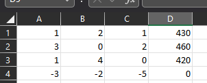
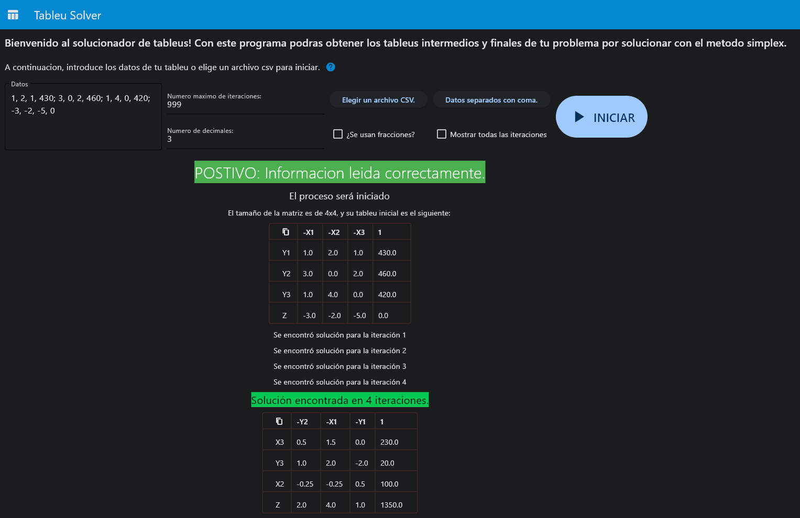

# GUÍA DE INICIO

## Bienvenida.

¡Hola! Sé bienvenido a este programa, esperamos que te sea útil. Como ya sabes, este programa está destinado a ilustrar de la mejor manera posible la solución de poblemas de optimización llevando a cabo un simple pero efectivo algoritmo algebráico, siempre partiendo del primer tableu del que parte el problema.

## ¿Qué puedo hacer?

Lo que este programa puede hacer:
- Solucionar un problema de investigación de operaciones a partir del tableu inicial.
- Mostrar todas las iteraciones realizadas para llegar a la solución, como si se hubiera hecho el procedimiento a mano.
- Personalizar los resultados, ya sea que estén escritos como fracciones, o que sean números con un determinado número de decimales.

Lo que NO puede hacer este programa:
- Dar la respuesta a la pregunta planteada del problema dado.
- Encontrar la solución escribiendo el planteamiento algebráico.
- Acomodar tu cuarto.

## ¿Cómo debo iniciar? 

Una vez tenga el problema a solucionar, debes buscar la manera de plantearlo, existen distintos tipos de problemas y cada uno tiene una "plantilla" para poderse guiar, posteriormente debe generar su tableu inicial, esto es lo más importante pues un tableu mal planteado hará que no se encuentre un resultado, o que el resultado no sea satisfactorio. A continuación, se ejemplificarán todos los pasos con un procedimiento sencillo.

### Planteamiento del problema.

Una empresa de juguetes utiliza tres operaciones para armar tres tipos de juguetes: trenes, camiones y carros. Sin embargo, cada operación tiene un tiempo limitado, y cada tipo de juguete tiene un ingreso dado, además de que también se cuenta con un tiempo de ensamble para cada producto. Con estas limitaciones, se busca obtener las cantidades a producir de cada juguete de forma que se obtenga la mayor ganancia posible. Los datos se han almacenado en la siguiente tabla:

| Operaciones | Tren | Camión | Auto | Tiempo disponible diario |
| ----------- | ---- | ------ | ---- | ------------------------ |
| 1           | 1    | 2      | 1    |  430 min.                |
| 2           | 3    | 0      | 2    |  460 min.                |
| 3           | 1    | 4      | 0    |  420 min.                |
| Ingresos    | 3    | 2      | 5    |                          |

Donde las tres columnas de enmedio indican el tiempo en producir cada tipo de juguete por operación, mientras que la última fila indica los ingresos que se obtendrán de una unidad de cada tipo de juguete.

### Planteamiento algebráico.
Ahora procedemos a algo muy importante, y es plantear nuestro problema en lenguaje matemático. Para empezar, ¿qué queremos hacer? en este ejemplo queremos que la ganancia sea la máxima posible, por lo que debemos **maximizar**, además, lo que queremos maximizar es el ingreso, por lo que podemos plantear esto como una combinación lineal de nuestros productos, por el ingreso de cada uno. Nuestra **función objetivo** será la siguiente:

$$ Maximizar \, Z = 3 X_1 + 2 X_2 + 5 X_3 $$

A partir de ahora usaremos a las $X_i$ para representar a nuestros juguetes, a los que llamaremos *variables de decisión*, de tal forma que:
- Tren = $X_1$.
- Camión = $X_2$
- Auto = $X_3$

Lo que sigue es plantear las restricciones, en este caso, podemos ver que nuestro planteamiento está *sujeto a* no sobrepasar las limitaciones de cada tipo de operación, lo que se encuentra en la última columna de la tabla, además, la cantidad de minutos que se ocupa para cada tipo de juguete también se encuentra en la tabla, de esta forma llegamos a lo siguiente:

- Tiempo máximo de la operación 1: $X_1 + 2 X_2 + X_3 \leq 430$
- Tiempo máximo de la operación 2: $3 X_1 + 0 X_2 + 2 X_3 \leq 460$ 
- Tiempo máximo de la operación 2: $X_1 + 4 X_2 + 0 X_3 \leq 420$
- Restricción de no negatividad: $X_1, X_2 \geq 0$

Esta última restricción es bastante obvia puesto que, en el mundo real, no podemos tener juguetes negativos.

### Plantear mi tableu.

Estamos llegando a la recta final, lo que sigue ahora es realizar el tableu, el cual es una representación en forma de tabla de nuestro problema. Para poder plantearlo debemos partir de despejar nuestras ecuaciones de forma que las *variables de decisión* queden del lado izquierdo de la desigualdad, mientras que para la función objetivo $Z$ cambiaremos de signo todos sus valores:

- $Y_1: X_1 + 2 X_2 + X_3 \leq 430$
- $Y_2: 3 X_1 + 0 X_2 + 2 X_3 \leq 460$ 
- $Y_3: X_1 + 4 X_2 + 0 X_3 \leq 420$
- $Maximizar \, Z: -3 X_1 - 2 X_2 - 5 X_3 = 0 $

Lo que hace que nuestro **tableu** quede de la siguiente forma:

|       | $-X_1$ | $-X_2$ | $-X_3$ | Sol. |
| ----- | ------ | ------ | ------ | ---- |
| $Y_1$ |   1    |   2    |   1    | 430  |
| $Y_2$ |   3    |   0    |   2    | 460  |
| $Y_3$ |   1    |   4    |   0    | 420  |
|  $Z$  |  -3    |   -2   |   -5   |  0   |

### Y ahora... ¿cómo lo resulevo?

Aquí es donde entra el programa que ha descargado, está claro que la mayor parte del trabajo aún está en sus manos, sin embargo, gracias a este software puede ahorrarse la molestia de resolver este tableu. La solución es encontrada por la reducción de Jordan, un procedimiento que, si bien, no es complejo, puede llegar a ser tedioso, así que transformemos esto en algo que el programa pueda interpretar.

#### Convertir mi tableu a datos separados por comas.

La forma más rápida de tener información que el programa puede interpretar es escribiendo los datos como una cadena separada por comas y punto y coma, la coma indica un cambio de celda, mientras que el punto y coma indica un salto de fila, así es como llegamos a la siguiente cadena de texto:
``` 1, 2, 1, 430; 3, 0, 2, 460; 1, 4, 0, 420; -3, -2, -5, 0 ```

Es importante destacar que el programa ignorará los espacios y los saltos de línea, así que si gusta de estilizar esta cadena puede hacerlo con toda confianza.

#### ¿Algo para los que preferimos Excel?

¡Claro que están tomados en cuenta! Sin embargo, es de conocimiento popular que Excel es conocido por tener su propia forma de interpretar información, por lo que puede llegar a ser tedioso tener que lidiar con problemas de compatibilidad, además de que el archivo debe ser guardado como CSV y la tabla debe encontrarse en la zona superior izquiera, justo al inicio, quedaría algo de la siguiente forma:



¡Muy importante! Guarde el archivo como CSV, puesto que es el único formato que el programa acepta, también es recomendable no olvidar la ubicación de guardado por razones bien conocidas.

#### ¡Para esto también hay reglas!

Debe tener muy en cuenta lo siguiente:
- Los valores indicados deben de ser numéricos, puede usar el guión corto para indicar un número negativo, y un punto para indicar los decimales.
- Si lo prefiere, también puede indicar sus números como fracciones usando una diagonal, por ejemplo: 1/3.
- Sin embargo, si quiere tener sus resultados como fracciones entonces está prohibido usar decimales, y visceversa.
- Los tamaños de filas y columnas deben ser concordantes, y los valores nulos no existen, es preferible usar ceros y no dejar la celda vacía.

#### ¿Cómo obtener mi resultado?

Una vez tenga su información lista, abra el programa y lo primero que podrá observar son varios botones, se mencionará que hace cada uno.


- Número máximo de iteraciones (indicar un entero positivo): Le indica al programa cuando debe detenerse, usualemente no se requieren muchas iteraciones para un problema con pocas variables, pero esto puede cambiar en planteamientos con muchas, elija de acuerdo a la magnitud de su problema, aún si pone 0 el programa realizará la primera iteración.
- Número de decimales (indicar un entero positivo): Si sus resultados serán representados con decimales, puede elegir cuantas de estas serán mostradas, no nos gustaría ver un resultado con más decimales que números, ¿cierto?
- ¿Se usan fracciones? (casilla marcable): marcar esta casilla hará que sus resultados y datos se muestren e interpreten como fracciones, ¡recuerde las reglas!
- Mostrar todas las iteraciones (casilla marcable): si quiere ver paso a paso como se resuelve su tableu entonces marque esta casilla, solo recuerde que podría resultar en algo muy largo.
- Los últimos botones se explicarán con más profundidad a continuación.

#### Elegir un archivo CSV.

Presionar este botón abrirá un recuadro que le pedirá un archivo, se abrirá un segundo recuadro donde deberá buscar el archivo que guardó anteriormente, una vez seleccionado presione aceptar y luego añadir datos, eso hará que aparezca el nombre de su archivo del lado derecho.

#### Datos separados por comas.

Con este botón podrá introducir los datos que escribimos anteriormente, aquellos escritos con comas y punto y coma, una vez escritos presione en añadir datos, eso hará que lo que escribió aparezca del lado izquierdo.

#### ¡Iniciar!

Se sabe que presionar el gran botón azul es tentador, pero primero es recomendable que revise su información antes de iniciar, que no se haya colado alguna letra furtiva por ahí, o que haya transcrito algún valor mal, si no es el caso entonces está listo para presionar el gran botón azul.



¡Hemos conseguido un resultado! Las señalizaciones en verde indican que todo ha marchado de maravilla, además, los textos nos dirán si se ha logrado conseguir una solución o si simplemente se detuvo por llegar al máximo de iteraciones.

### ¿Y ahora que hago con esto?

Podemos resumir nuestros datos obtenidos en los siguientes puntos:

#### La ganancia que obtendremos.

El valor de la función objetivo está mostrada en el último recuadro de la tabla, es decir, aquella en la fila $Z$ y columna $1$, en este caso, el ingreso que obtendremos será de $1,350.00.

#### Cuantas unidades se realizarán al día.

Para obtener cuanto es lo que valen al final nuestras variables de decisión, basta con ubicar todas las $X$ encontradas en las filas y columnas, de modo que en el otro extremo se encontrará el valor buscado, de tal forma que:

- $X_1$ y $4.0$ indican que se realizarán 4 trenes.
- $X_2$ y $100$ indican que se realizarán 100 camiones.
- $X_3$ y $230$ indican que se realizarán 230 autos.

#### Análisis de sensibilidad.

Eso está pendiente.

## ¿Qué puede salir mal?

El programa está diseñado para manejar errores, desde haber escrito mal algo, hasta haber hecho un planteamiento no óptimo, se indicará en el mismo programa cuál es el error que se está cometiendo, no obstante, los siguientes casos son de preocupación:
- Se indica un error pero los datos están correctos.
- Se procede con la solución pero esta es demasiado extraña (esto también puede suponer un problema de planteamiento).
- El programa se cierra.

En estos casos, favor de enviar un video recreando el error al contacto indicado, ayudará mucho a solucionar todos estos problemas.

## Otros ejemplos.

### Problemas de minimización.

El método simplex se aplica del mismo modo a los problemas de minimización, una de las maneras de lograrlo es la siguiente:

* Convirtiendo el problema de minimización en uno de maximización: $Min Z = -Max(-Z)$ de modo que se resuelve el problema $Maximizar(-Z)$ con las restricciones dadas, y una vez se obtiene el valor máximo, hay que cambiarle el signo para obtener el valor mínimo de $Z$.

#### Ejemplo 2.

$$Minimizar \, Z=-4x+2y$$

$$sujeto \, a -x+3y \leq 14$$

$$4x-y \leq 10$$

$$x,y \geq 0$$

Usando $Min \, Z=-4x+2y= -Max \, Z' = 4x-2y$ se resuelve el problema de maximizar la función objetivo $Z'$. El tableu inicial será de la siguiente forma:
|     |$x_1$|$x_2$| sol |
|-----|-----|-----|-----|
|$y_1$|$-1$ |$3$  |$14$ |
|$y_2$|$4$  |$-1$ |$10$ |
|$Z$  |$4$  |$-2$ | $0$ |